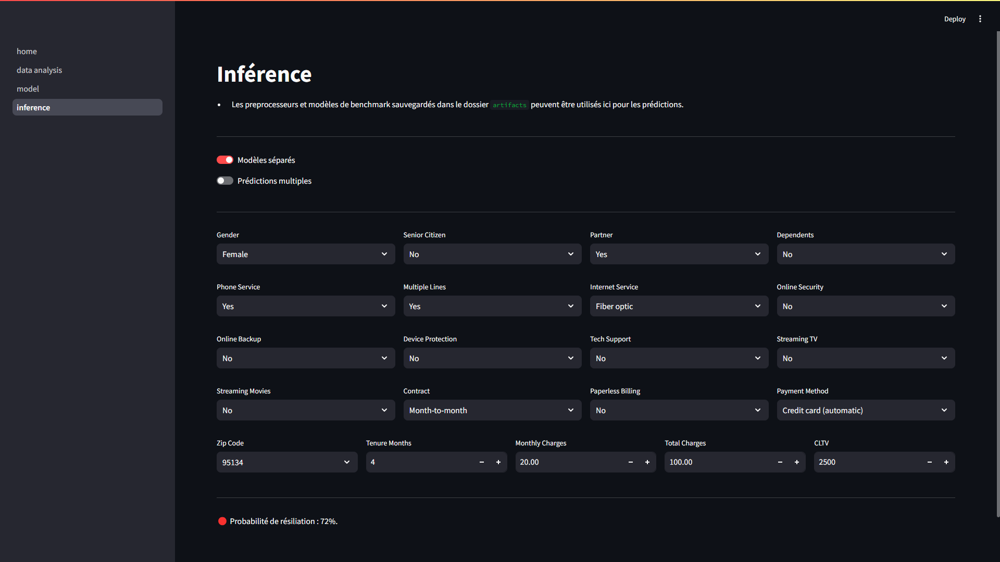

# Classification du churn dans une entreprise de services numériques

L'objectif est de prédire la résiliation des clients d'une entreprise de services téléphoniques et Internet à l'aide d'un modèle de Machine Learning.

## Présentation des interfaces

### 1. Une page d'accueil qui décrit les variables


### 2. Les résultats d'analyse les plus importants


### 3. Un playground pour tester différents modèles


### 4. Une interface d'inférence sur de nouvelles données



## Exécution

1. Cloner le repo

    ```sh
    git clone https://github.com/bryantchakote/churn-services-numeriques.git
    cd churn-services-numeriques
    ```

2. Configurer l'environnement (optionnel mais recommandé)

    ```sh
    conda env create -f environment.yaml
    conda activate churn-services-numeriques
    ```

3. Lancer l'application Streamlit

    ```sh
    streamlit run streamlit/home.py
    ```
