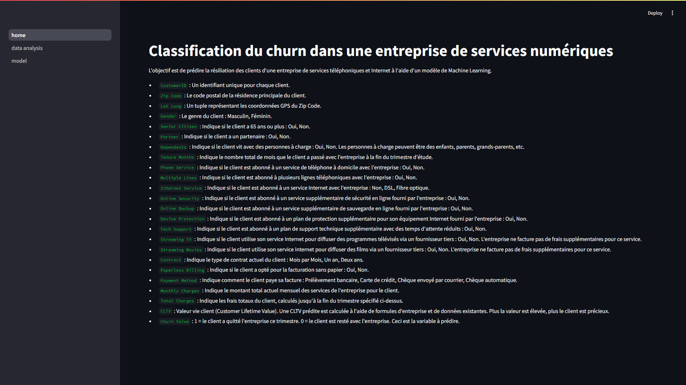
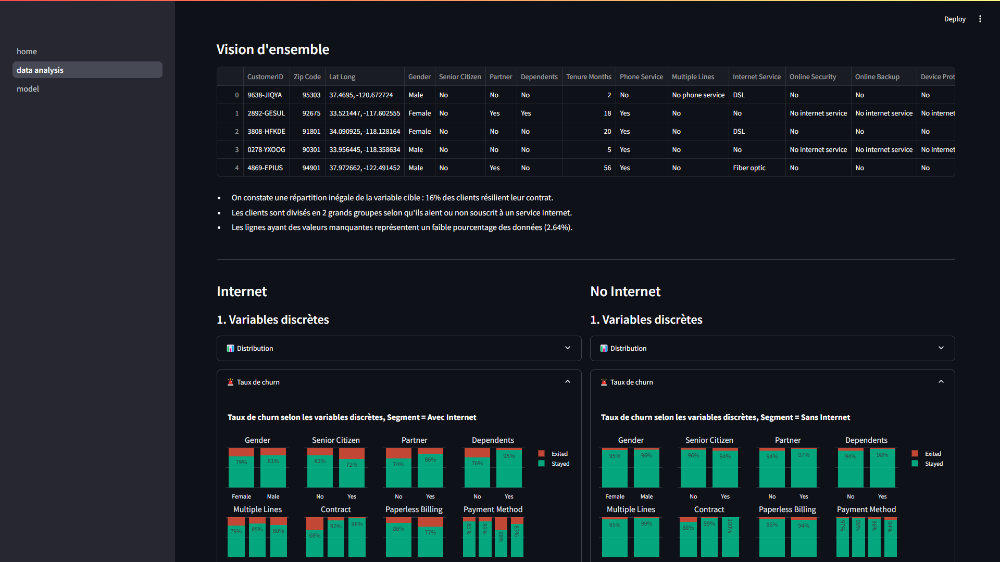
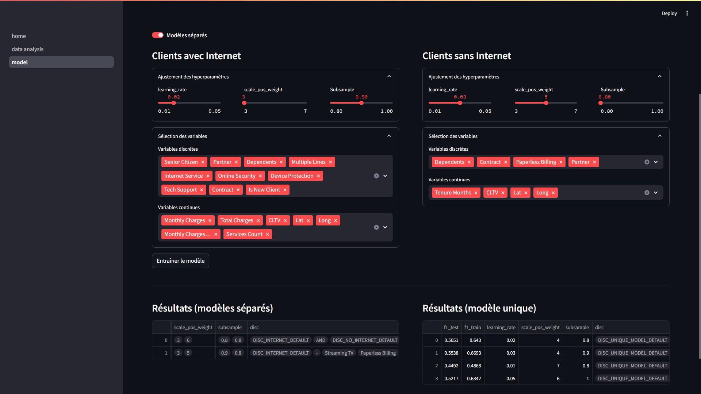

# Classification du churn dans une entreprise de services numériques

L'objectif est de prédire la résiliation des clients d'une entreprise de services téléphoniques et Internet à l'aide d'un modèle de Machine Learning.

L'application compote 3 interfaces :

- Une page d'accueil qui décrit les variables



- Quelques résultats d'analyse importants



- Un playground pour tester différents modèles



1. Cloner le repo

    ```sh
    git clone https://github.com/bryantchakote/churn-services-numeriques.git
    cd churn-services-numeriques
    ```

2. Configurer l'environnement (optionnel mais recommandé)

    ```sh
    conda env create -f environment.yaml
    conda activate churn-env
    ```

3. Lancer l'application Streamlit

    ```sh
    streamlit run streamlit/home.py
    ```
