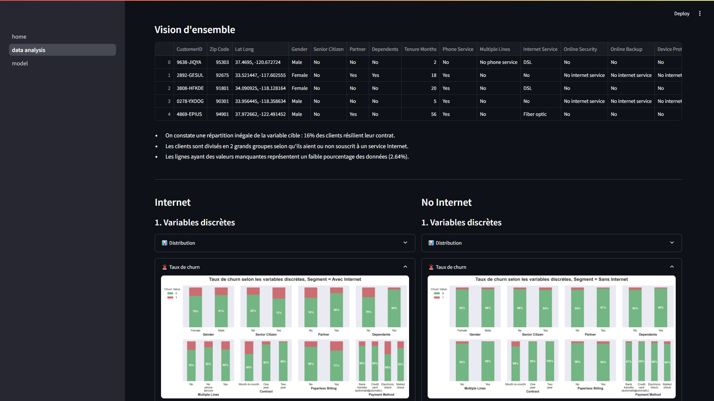

# Classification du churn dans une entreprise de service numérique

L'objectif est de prédire la résiliation des clients d'une entreprise de services téléphoniques et Internet à l'aide d'un modèle de Machine Learning.

- `CustomerID` : Un identifiant unique pour chaque client.
- `Zip Code` : Le code postal de la résidence principale du client.
- `Gender` : Le genre du client : Masculin, Féminin.
- `Senior Citizen` : Indique si le client a 65 ans ou plus : Oui, Non.
- `Partner` : Indique si le client a un partenaire : Oui, Non.
- `Dependents` : Indique si le client vit avec des personnes à charge : Oui, Non. Les personnes à charge peuvent être des enfants, parents, grands-parents, etc.
- `Tenure Months` : Indique le nombre total de mois que le client a passé avec l'entreprise à la fin du trimestre d'étude.
- `Phone Service` : Indique si le client est abonné à un service de téléphone à domicile avec l'entreprise : Oui, Non.
- `Multiple Lines` : Indique si le client est abonné à plusieurs lignes téléphoniques avec l'entreprise : Oui, Non.
- `Internet Service` : Indique si le client est abonné à un service Internet avec l'entreprise : Non, DSL, Fibre optique.
- `Online Security` : Indique si le client est abonné à un service supplémentaire de sécurité en ligne fourni par l'entreprise : Oui, Non.
- `Online Backup` : Indique si le client est abonné à un service supplémentaire de sauvegarde en ligne fourni par l'entreprise : Oui, Non.
- `Device Protection` : Indique si le client est abonné à un plan de protection supplémentaire pour son équipement Internet fourni par l'entreprise : Oui, Non.
- `Tech Support` : Indique si le client est abonné à un plan de support technique supplémentaire avec des temps d'attente réduits : Oui, Non.
- `Streaming TV` : Indique si le client utilise son service Internet pour diffuser des programmes télévisés via un fournisseur tiers : Oui, Non. L'entreprise ne facture pas de frais supplémentaires pour ce service.
- `Streaming Movies` : Indique si le client utilise son service Internet pour diffuser des films via un fournisseur tiers : Oui, Non. L'entreprise ne facture pas de frais supplémentaires pour ce service.
- `Contract` : Indique le type de contrat actuel du client : Mois par Mois, Un an, Deux ans.
- `Paperless Billing` : Indique si le client a opté pour la facturation sans papier : Oui, Non.
- `Payment Method` : Indique comment le client paye sa facture : Prélèvement bancaire, Carte de crédit, Chèque envoyé par courrier, Chèque automatique.
- `Monthly Charge` : Indique le montant total actuel mensuel des services de l'entreprise pour le client.
- `Total Charges` : Indique les frais totaux du client, calculés jusqu'à la fin du trimestre spécifié ci-dessus.
- `CLTV` : Valeur vie client (Customer Lifetime Value). Une CLTV prédite est calculée à l'aide de formules d'entreprise et de données existantes. Plus la valeur est élevée, plus le client est précieux. Les clients de grande valeur doivent être surveillés pour éviter leur départ.
- `Churn Value` : 1 = le client a quitté l'entreprise ce trimestre. 0 = le client est resté avec l'entreprise. Ceci est la variable à prédire.
